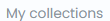
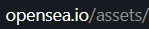

# opensea-macro
You might have read some artciles or Reddit posts about using "macros" to upload 10,000 NFTs to OpenSea without custom smart contracts. So I wrote an example and tested it.

## Disclaimer: This is intended for developers who understand scripting.
## Disclaimer: I cannot guarantee its working and I do not intend to work further on this as it was just supposed to be a small example of using PyAutoGUI for people who're minting multiple NFTs without using Smart Contracts. Feel free to modify as per your use. Currently it only uses 1 property but I'm sure it's easy to add more properties with using a few more Tabs and Enters. 

Main file: ***scripttoupload.py***

The other py script is just what I used to list some of the NFTs, but it was bare minimum, so you can ignore it, or learn from it and make your own. It basically uses pre-opened tabs to list NFTs and closes them. You have to manually open all the tabs.

The objective of the script is to provide functions to upload multiple files to OpenSea collection using Python + PyAutoGUI.
[I have managed to mint 3001 NFTs on my secondary account using it (in 24 hours, with pauses).](https://opensea.io/collection/bringbacktheegg/)

Requires: 
- PyAutoGUI: `pip install pyautogui`
- You need to have the `create` url, for eg. `https://opensea.io/collection/collectionnamehere/assets/create`
- You may or may not need to have all the images/screenshots that are to be used:
  - Collection Name
  - Collection Image
  - Partial screenshot of Tab
  - Add Item button
  - "My Collections" part of the upload page
  - Image of the blockchain on the upload page
  - Sell button
  - Part of the upload button (Drag & drop file)
  - Part of the url bar with opensea.io/assets (This is used to confirm that the NFT is minted after the upload process)

**Check assets folder for an idea on how the screenshots should look like**

Some information:
- **I have used this script in half-window. So OpenSea collection window on the left and the script running on the right part of the screen (15.6 inches). Not sure if it'll work the same for everyone. It's highly recommended to test and modify.**
- **The script is semi-flexible, but you can definitely make it work if you have a little programming knowledge.**
- **This is still not 100% guaranteed to work.** I had to come back to the system and check once in a while to see it stopped working because a page didn't load fast enough.
- The script can be fast at times so you can modify the _pyautogui.PAUSE_ to add pause between each action. Or if you wanna add a pause at certain time, you can modify the _sleep()_ call. Or add your own sleep calls wherever you feel the action needs delay.
- The script can use a json file ('output.json') containing the NFTs with ID's and some other details like colors/attributes etc. This information needs to be structured by you.
- Some of the functions are not being used since I've directly used PyAutoGUI methods everywhere and didn't replace those calls later.
- **It is recommended to test out the script on OpenSea testnet before you start practicaly using it.**
- I have included a selling script to sell NFTs opened on multiple tabs. But I didn't implement tracking of the buttons because it's simpler to store coordinates of buttons.

What the `upload(item)` function does:

- Here, the _item_ is: the index and the filename that's to be uploaded. (e.g. 1.png, 2.png, etc.)

- `checkifpageloaded()` checks if the "My Collections" is visible on the page.

- Next thing we make sure if the upload button is tracked or not (using a global variable). If not, then the image upload button is used to match with the upload button on screen and coordinates are saved.

- Here's what the part of upload button I'm using to get the coordinates:
  

- So the script clicks the upload button, then the file explorer opens, and in the `File Name:` bar, the location of the image is entered and then `Enter` is pressed.

- The rest of the function uses Tabs and Enters to go through the upload processes, then goes back to the collection create URL. 

- Finally once uploaded and minted, the it redirects to the assets page where the script confirms upload by checking the URL. 
  

This process can be repeated by loops. And I'm not providing the main function (i.e. loops and function calls) so people don't end up running it mindlessly.

Keywords: 10,000 NFTs, opensea mint, macro script, semi-functioning, opensea, NFT, script to upload to opensea
